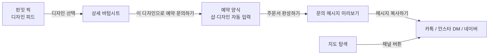

# PinIt (핀잇)

네일·케이크·타투·속눈썹·꽃집처럼 디자인을 보고 고르는 샵을 찾고, 마음에 드는 디자인으로 예약 문의 메시지까지 한 번에 만들 수 있도록 만든 Flutter 기반 모바일 앱입니다.

> 인스타그램에서 디자인을 찾고, 샵마다 다른 채널(네이버·카톡·인스타 DM)로 같은 내용을 반복해서 보내던 예약 과정을 하나의 흐름으로 줄이는 것을 목표로 제작했습니다.

## 1. Links

- **배포 사이트 (Flutter Web):** https://pinit-beta.vercel.app/
- **GitHub:** https://github.com/yeonland/portfolio/tree/main/pinit_app

## 2. 프로젝트 배경

네일아트, 레터링 케이크, 타투처럼 디자인이 중요한 업종은 대부분 인스타그램으로 디자인을 보고 카카오톡이나 인스타 DM으로 예약을 문의합니다. 샵마다 예약 채널이 달라 사용자는 원하는 디자인, 날짜, 시간, 연락처를 매번 새로 정리해서 보내야 합니다. 핀잇은 디자인 탐색 → 샵 확인 → 예약 문의를 하나의 앱 안에서 이어지도록 기획했습니다.

## 3. 핵심기능

| 기능 | 내용 |
| --- | --- |
| 핀잇 픽 (디자인 피드) | 3열 정사각형 피드로 디자인을 보여주고, 각 이미지에 가격표를 표시합니다. |
| 검색 · 해시태그 필터 | 디자인명·샵 이름·키워드 검색과 `#시럽네일`, `#레터링` 등 해시태그 필터를 함께 적용합니다. |
| 지도 탐색 | 카테고리별로 샵을 필터링하고, 샵마다 지원하는 예약 채널(네이버·카톡·인스타) 버튼을 보여줍니다. |
| 스마트 예약 주문서 | 피드에서 고른 디자인이 자동으로 입력되고, 날짜·시간·예약자 정보를 채우면 예약 문의 메시지를 생성합니다. |
| 메시지 복사 | 완성된 문의 메시지를 클립보드에 복사해 카톡·인스타 DM에 바로 붙여넣을 수 있습니다. |
| 다크 모드 | 상단 스위치로 라이트/다크 테마를 전환합니다. |

## 4. 화면 흐름



하단 탭(`지도 탐색` / `핀잇 픽` / `예약 양식`) 사이의 데이터 전달은 상위 위젯인 `MainNavigationScreen`이 선택한 디자인을 상태로 보관하고, 예약 양식 화면에 전달하는 방식으로 구성했습니다. 다른 디자인을 고르면 `ValueKey`가 바뀌면서 예약 양식이 새 디자인 기준으로 다시 채워집니다.

## 5. 기술 스택

| 구분 | 사용 기술 |
| --- | --- |
| App | Flutter, Dart |
| UI | Material Design (Material 3) |
| Platform | Android · iOS · Web (Flutter 멀티 플랫폼) |
| Test | flutter_test (위젯 테스트) |
| Deployment | Vercel (Flutter Web 빌드), GitHub |
| Code Quality | flutter_lints |

## 6. 폴더 구조

```text
pinit_app/
├─ lib/
│  └─ main.dart              # 앱 전체 화면 (탭 구성, 지도 탐색, 핀잇 픽, 예약 양식)
├─ test/
│  └─ widget_test.dart       # 앱 실행 · 디자인 자동 입력 · 입력 검증 테스트
├─ web/                      # Flutter Web 진입점 (index.html, manifest.json, 아이콘)
├─ android/                  # 안드로이드 빌드 설정
├─ ios/                      # iOS 빌드 설정
├─ analysis_options.yaml     # 린트 설정
└─ pubspec.yaml              # 패키지 및 프로젝트 정보
```

## 7. 실행 방법

### ① 저장소 복제 및 패키지 설치

```bash
git clone https://github.com/yeonland/portfolio.git
cd portfolio/pinit_app
flutter pub get
```

### ② 실행

```bash
flutter run -d chrome      # 웹 브라우저로 실행
flutter run                # 연결된 안드로이드/iOS 기기 또는 에뮬레이터로 실행
```

### ③ 테스트 · 정적 분석

```bash
flutter test
flutter analyze
```

### ④ 웹 빌드 및 배포

```bash
flutter build web --release
cd build/web
npx vercel deploy --prod
```

> **Windows 참고:** 프로젝트 경로에 한글이 있으면 `flutter analyze`, `flutter test`가 실행 도중 종료됩니다. `subst P: "프로젝트 경로"`로 영문 드라이브를 만들어 실행하거나, 영문 경로로 프로젝트를 옮겨 사용합니다. 자세한 내용은 [9. 문제 해결](#한글-경로에서-flutter-도구-오류)을 참고하세요.

## 8. 구현 현황

### 구현 완료

- 하단 탭 3개(지도 탐색 · 핀잇 픽 · 예약 양식) 구성
- 라이트/다크 모드 전환
- 핀잇 픽: 3열 피드, 가격표, 검색, 해시태그 필터, 검색 결과 없음 안내
- 핀잇 픽: 디자인 상세 바텀시트
- 지도 탐색: 카테고리 필터, 샵 카드, 샵별 예약 채널 버튼
- 예약 양식: 핀잇 픽에서 고른 디자인 자동 입력
- 예약 양식: 날짜(달력) · 시간 · 이름 · 연락처 · 요청사항 · 문의 채널 입력
- 예약 양식: 필수 항목 및 연락처 형식 검증
- 예약 문의 메시지 자동 생성 및 클립보드 복사
- 이미지 로딩 실패 시 자리표시 이미지 표시
- 위젯 테스트 3개 작성 및 통과
- Flutter Web 빌드 및 Vercel 배포

### 향후 구현

- 실제 지도 SDK(네이버 지도 · 카카오맵) 연동 및 현재 위치 기반 거리 계산
- 예약 채널 버튼을 실제 네이버 예약 · 카카오 채널 · 인스타그램 링크로 연결 (`url_launcher`)
- 찜하기(하트) 기능과 찜 목록
- 샵·디자인 데이터를 서버(DB)에서 불러오도록 분리
- 화면별 파일 분리 및 데이터 모델 클래스 정의
- 안드로이드 APK 빌드 및 실기기 테스트

## 9. 문제 해결

### 탭 사이의 데이터 전달

- **문제:** 핀잇 픽 탭에서 고른 디자인을 다른 탭인 예약 양식으로 넘겨야 했지만, 두 화면은 서로를 알지 못하는 독립된 위젯이었습니다.
- **개선:** 공통 상위 위젯인 `MainNavigationScreen`에서 선택한 디자인을 상태로 관리하고, 핀잇 픽에는 콜백(`onReserve`)을, 예약 양식에는 디자인 데이터를 전달했습니다.
- **결과:** "이 디자인으로 예약 문의하기"를 누르면 탭이 전환되면서 샵 이름 · 디자인 · 가격이 자동으로 채워집니다.

### 네트워크 이미지 오류

- **문제:** 이미지를 불러오지 못하면 피드에 오류 화면이 표시되었고, 네트워크가 차단된 테스트 환경에서는 위젯 테스트가 실패했습니다.
- **개선:** `Image.network`에 `errorBuilder`를 추가해 실패 시 회색 자리표시 아이콘을 보여주도록 했습니다.
- **결과:** 네트워크 상태와 관계없이 화면이 깨지지 않고, 테스트도 안정적으로 통과합니다.

### 한글 경로에서 Flutter 도구 오류

- **문제:** Windows에서 프로젝트 경로와 임시 폴더 경로에 한글이 포함되어 `flutter analyze`는 `FormatException`으로, `flutter test`는 `Connection closed before test suite loaded`로 실행 도중 종료됐습니다.
- **개선:** `subst` 명령으로 프로젝트를 영문 드라이브(`P:`)에 연결하고, `TEMP` · `TMP` 환경변수를 영문 경로로 지정해 실행했습니다.
- **결과:** 코드 수정 없이 정적 분석, 테스트, 웹 빌드를 정상적으로 실행할 수 있게 됐습니다.

## 10. 현재 한계

- 지도 탐색 화면은 실제 지도가 아닌 배경 위에 핀을 고정 배치한 화면입니다.
- 지도 탐색의 예약 채널 버튼은 안내 메시지만 표시하며 외부 앱으로 연결되지 않습니다.
- 샵 · 디자인 데이터는 코드에 작성된 더미 데이터이며, 이미지는 임의 이미지(picsum)를 사용합니다.
- 찜하기(하트) 아이콘은 UI만 구현된 상태입니다.
- 예약 문의는 메시지 복사까지만 지원하며, 실제 예약 확정이나 내역 저장은 하지 않습니다.
- 모든 화면이 `main.dart` 한 파일에 작성되어 있어 기능이 늘어나면 구조 분리가 필요합니다.

## 11. 검증 결과

- `flutter test`: 3개 테스트 모두 통과
  - 앱 실행
  - 핀잇 픽에서 예약 문의 시 예약 양식 자동 입력
  - 날짜·시간 미선택 시 안내 메시지 표시
- `flutter analyze`: 오류 없음, 안내(info) 2건
  - `Switch.activeColor`, `Color.withOpacity` 사용에 대한 deprecated 안내로, 동작에는 영향이 없습니다.
- `flutter build web --release`: 통과

## 12. 회고

이 프로젝트를 통해 Flutter의 위젯 구조와 `StatefulWidget` 상태 관리, 그리고 서로 다른 탭 사이에서 데이터를 주고받는 흐름을 경험했습니다. 특히 디자인 탐색에서 예약 문의까지 사용자가 끊기지 않고 이어지도록 화면을 연결하면서, 기능 하나보다 화면 사이의 흐름을 설계하는 것이 중요하다는 점을 느꼈습니다. 앞으로 실제 지도와 예약 채널 링크를 연결하고, 화면별로 코드를 분리해 확장하기 쉬운 구조로 개선할 계획입니다.
